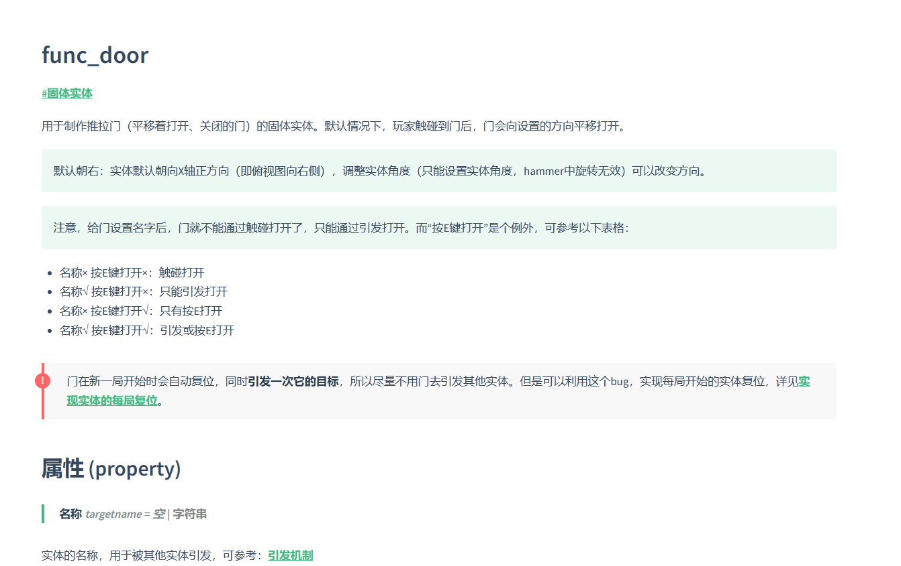

# 彩笔制图宝典：CS1.6地图制作/Hammer3.5 教程与百科

## 作为CSer和地图制作者，我想说的话
我是AllocBlock，从CS的诞生到现在已经有20多年了，期间有无数爱好者参与到社区地图的制作中，给CS增添了太多的活力，也给我们留下了太多的美好回忆。但现在回头看来，Hammer3.5实际上少有真正详尽、齐全的教程，mod-china已不复存在，贴吧删去了久远的帖子，奉为经典的X-man天书实际上是非完整品，距离V大最新的v34版编译程序发布已经过去七、八年了，那时没有好的文档，但知识可以通过交流来口口相传，可现在交流越来越少了，联系逐渐断开了，这些知识可能快要消失在历史上了。

这个项目的目的就是避免这一切地发生。我自诩拥有丰富地制图经验，熟悉引擎的特性，踩过各种各样的坑，遇到也解决了很多难题，但是这些经验至今几乎都只能烂在心里。利用这个我机会，我想尽量把一切我知道的东西都记录下来，给后继者一份好看的资料。但我一个人的力量终究有限，我熟悉的领域也很局限，遇到的问题也只是沧海一粟，我也需要你的帮助，来完善这个文档。

- **如果你熟悉技术。** 本Wiki是使用Docsify生成的，它基于Markdown，你可以Clone后修改Wiki，然后提交Pull request
- **也可以直接私聊发给我。** 你的经验、妙招、遇到的难题、有趣的经历、给读者的忠告、对Wiki的看法建议等等，通通都可以发给我，我会帮你更新到Wiki中
    - QQ: **[690051933](tencent://message/?uin=690051933)**
    - 邮箱：**690051933@qq.com**
- 欢迎加入QQ群 [彩笔的逆袭 群号：15876347](https://jq.qq.com/?_wv=1027&k=e6eqbt1u) 一起玩耍！

## 环境配置
- 因为Docsify是动态加载Markdown文件并解析的，它需要挂载到服务器上才能工作，**不能直接双击打开index.html**
  - 你可以使用VS Code的Live server插件，一键即可搭建本地服务器
  - 或者按照[Docsify文档](https://docsify.js.org/#/zh-cn/quickstart)的步骤配置环境，然后使用docsify serve docs搭建本地服务器
  - 你可以自己搭建本地服务器，比如通过phpStudy软件

## 成果展示

