# 发挥你的创意

## 本节中你会了解
- 如何布置一个房间
- 一些常用实体的用法
- 创造想象中的世界

## 修改房间纹理
- 目前我们的房间里还非常空荡，我们来扩展一下空间，分成很多个房间来布置
- **拓宽房间**：首先我们的盒子可能不够大，通过“选择工具”来移动墙面、修改墙面尺寸。
	- 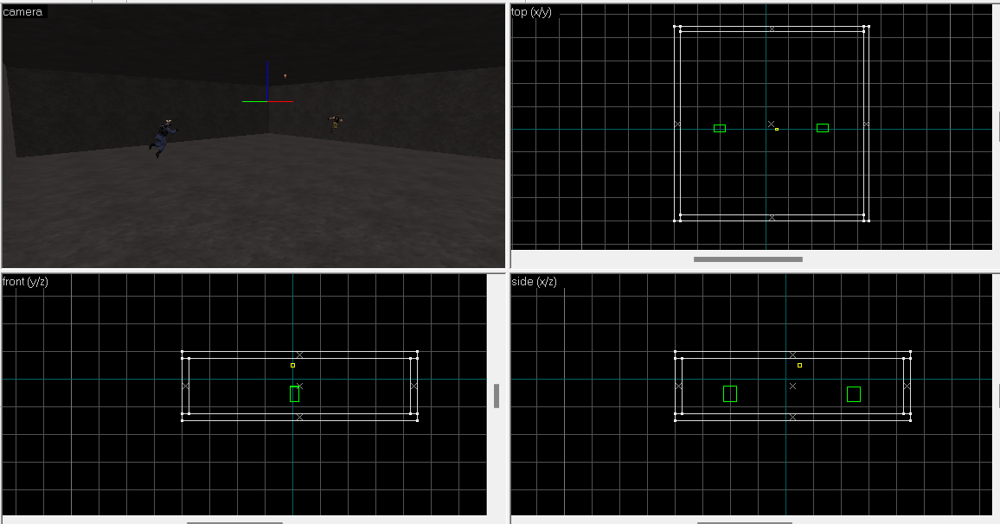
- **更改单个面的纹理**：我们把地面、墙面和天花板设置成合适的纹理。hammer提供了工具，可以**单独设置某个面的纹理**。点击工具栏的”纹理调整工具“，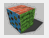，会弹出新的窗口。
	- 保持这个窗口打开，就可以鼠标点击来选择某个面了
	- 点击“应用”能把当前纹理贴到选中的面上
	- 按住Ctrl可以多选
	- 我们分别把地面、墙面和天花板换成```C1A3FLOOR02```、```FIFTIES_WALL14```和```FIFTIES_CEIL5```纹理


- **对齐纹理**：墙面的纹理没有对齐，“纹理调整工具”也提供了辅助对齐的方法。
	- 调整对齐主要是调整缩放、移动和旋转的值，但一般不需要手动填写，hammer给了一些辅助的按钮
		- 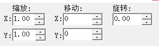
	- 在CS中，纹理会自动平铺，就像一块块地砖一样，这样一个很小的纹理重复很多次，就能做出很大的面（比如地板、天花板）
	- 对齐方式用来辅助对齐，几个按钮分别有以下功能：
		- 整面：把纹理贴到选中的整个面上
		- 顶部、底部、左边、右边：纹理的上、下、左或右对齐到面的上、下、左或右
		- 中心：纹理中心对齐到面的中心
		- 一般最常用的就是整面
	- 这里也是用整面来对齐纹理


- 对其他三个墙面进行同样的操作，我们得到一个不错的房间了！

## 分隔房间
- 接下来我们往房间里放些东西
- 首先这么大的空间，我们希望把它分成几个小房间，用墙隔开，通过门进出
- **制作墙壁**：复制一个墙壁（你可以用```Ctrl+C```复制，```Ctrl+V```粘贴；或者按住```shift```拖拽选择的固体），放到中间，分出四个小房间，记得修改墙壁的纹理！

?> **组**：如果你发现选择盒子时，六个墙壁都同时选中了，这是因为他们属于同一个“组”。同一个”组“的物体会自动同时选中，方便你同时操作。你可以在快捷功能栏打开”忽略组“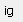按钮来暂时禁止同时选中组，也可以在选中后点击”解散当前组“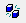。

?> **吸附到网格**：如果你发现不能精细的调整墙壁的位置，它总是吸附到网格上面，这是因为你开启了“吸附到网格”功能，并且网格密度开得太低。你可以按键盘快捷键```\[```让网格更密，按```\]```让网格更疏。或者可以在菜单栏→地图→吸附网格处关闭吸附到网格的功能“。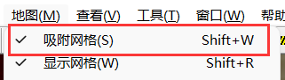

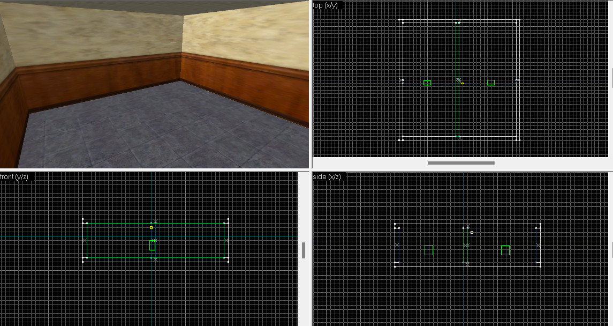

- **制作门**：我们新建一个固体，做出门的形状，贴上门的纹理（我这里正面用了```LAB1_DOOR7```，侧面用了```METAL_BORD01```）
	- 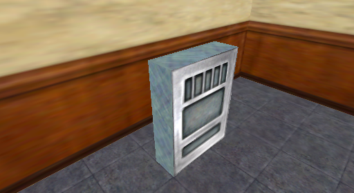
- **雕刻**：我们要在门上挖出门的空位，hammer提供了方便的实现。
	- 首先把门嵌入墙里，厚度记得大于墙
		- 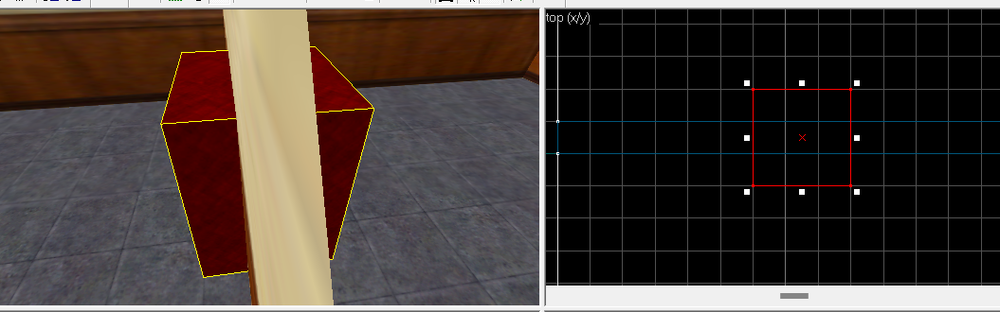
	- 先选门，然后选墙（按住Ctrl多选），接着点击菜单栏→工具→雕刻，墙上就会出现一个洞了。


- 把门放回去，拉扁，门的外形就做好了！
	- 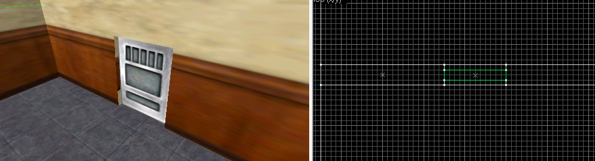
	- 目前做好的门是没有门的功能的，它还只有装饰作用。我们需要给他赋予门的功能，这需要使用实体。
- **轴心**：我们希望做一个**转门**，像这样能旋转的实体需要给它指定**旋转中心**，这需要通过```origin```轴心纹理来实现。
	- 创建一个固体，放在门的一侧，这个固体的中心对应这你想要的转轴中心
		- 这个固体的大小无所谓
	- 给固体贴上```origin```纹理
	- 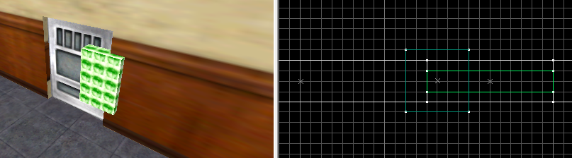
- **门实体**：同时选中门和轴心，点击右侧的“转换为实体”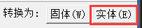，在菜单里选择```func_door_rotating```（转门实体）
	- 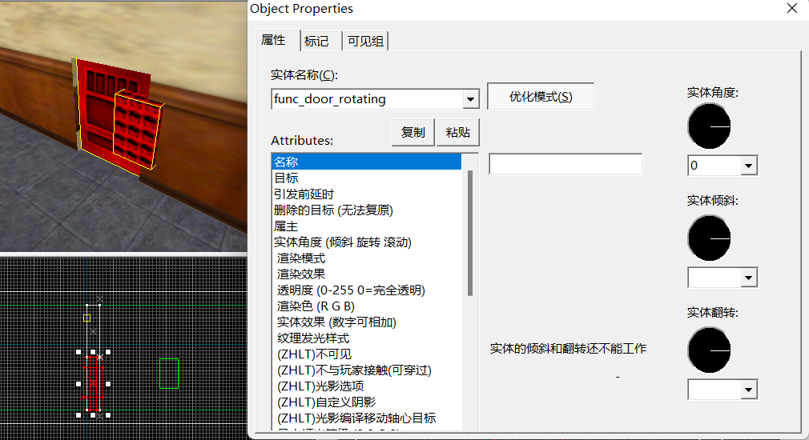
- **效果**：这样一个转门就制作完成了！同样的方法，在另外三面墙上也制作一个门（记得同样的东西可以直接复制）。这个门在游戏里是这样的：


## 更多实体的应用
- 除了实现门这样的效果，实体还能做许许多多事情
- [实体列表](wiki/entity/)里列举了每个实体的功能和使用方式，尽情翻阅！
- 下面会介绍一些常用实体

### 可破坏的箱子/玻璃
- 制作能被枪、毕设破坏的箱子、玻璃
- 实现制作一个方块固体放在地上，贴上箱子的纹理（这里用的```CRATE02```纹理）
	- 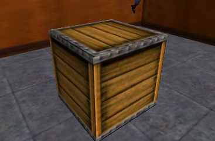
- 转换为[func_breakable](wiki/entity/func_breakable)（可破坏的物体）实体
	- “材质”填“木头”
	- “耐久度”填“100”
- 这样我们就有了一个100点耐久，能打碎的木箱子，他在游戏里是这样的：


- 类似的方法也可以制作玻璃
- 制作一片固体，贴上玻璃纹理（如```GLASS_BRIGHT```），转为[func_breakable](wiki/entity/func_breakable)
	- 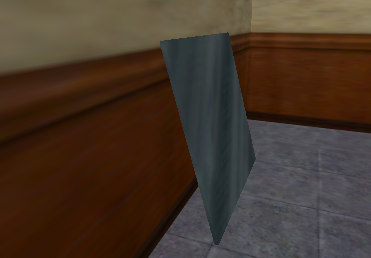
	- “材质”设为“玻璃”
	- “耐久”填“1”
	- “渲染模式”选“纹理”
	- “透明度”填“100”（0是完全透明，255是完全不透明）
	- 还在标记中勾上“可撞碎”，这样玻璃能被撞碎
	- 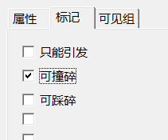
	- 
- 在游戏里效果是这样：


### 水
- 制作一个玩家能在里面游泳的水池
- 制作一个固体，贴上水的纹理，转为[func_water](wiki/entity/func_water)（这里顺便做了些装饰，变成一个水池）
	- “渲染模式”选“纹理”
	- “透明度”填“180”
	- “波浪高度”填“4”
	- 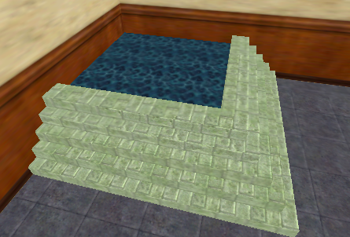
> 水纹理一般以```!```开头，贴上这种纹理后固体会直接被当作水实体处理
> 但一般还是需要转为func_water，来调整透明度、波浪大小等等

- 效果是这样的：


### 梯子
- 梯子是最常见的实体之一了，不过它的制作要复杂一些，需要用到两个实体
- 制作梯子时，我们需要两个实体：一个负责梯子的外观、另一个负责梯子的功能
- 制作梯子有不同的方法，这里介绍用[func_illusionary](wiki/entity/func_illusionary)（看得见摸不着的物体）和[func_ladder](wiki/entity/func_ladder)（梯子）实现的方法，另一种方法[func_ladder](wiki/entity/func_ladder)的说明里有提及。

#### 梯子外观部分
- 制作一个固体，宽度32，贴上梯子的纹理，对齐（自带的梯子纹理宽度也是32，点击中心对齐按钮即可对齐）（这里用的```{LADDER1```纹理）
	- 梯子纹理一般是以```{```开头的，这种以```{```纹理的蓝色部分是透明的，不过它还需要配合“渲染模式”才能透明，否则在游戏里会变成黑色。这种纹理常用来制作梯子、铁丝网这种镂空的结构。
- 把固体转为[func_illusionary](wiki/entity/func_illusionary)（看得见摸不着的物体），这种实体看得见，但是不会阻挡玩家移动
	- “渲染模式”选“**固体**”，这样蓝色部分就会透明
- 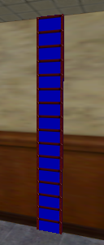

#### 梯子功能部分
- 制作一个固体，贴上```aaatrigger```纹理，和刚才的梯子重叠在一起，转为[func_ladder](wiki/entity/func_ladder)
	- [func_ladder](wiki/entity/func_ladder)默认是不可见，所以才需要配合一个外观实体来显示外观
	- 我们一般给看不见的实体贴上```aaatrigger```纹理，没有特别的功能，只是为了方便区分
	- 当然你可以不用做外观，这样就得到一个**隐形的梯子**了
	- 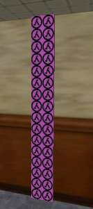

- 大功告成！[func_illusionary](wiki/entity/func_illusionary)负责显示梯子的外观，[func_ladder](wiki/entity/func_ladder)负责梯子的功能，他在游戏里是这样的：


### 进入区域触发文本
- 接下要实现的功能是，玩家进入指定区域时触发文本

#### 触发区域
- 我们使用[trigger_multiple](wiki/entity/trigger_multiple)来制作触发区域，玩家进入（或者呆在里面）时会触发目标，并且可以多次触发（能设置复位时间）
- 创建一个固体，用它划定一个区域，然后转为[trigger_multiple](wiki/entity/trigger_multiple)
	- “目标”填“mytext”
	- “复位前延迟”填“5”，这样触发一次后，等5秒后能再次触发
	- 注意[trigger_multiple](wiki/entity/trigger_multiple)本身是**不可见的**
	- 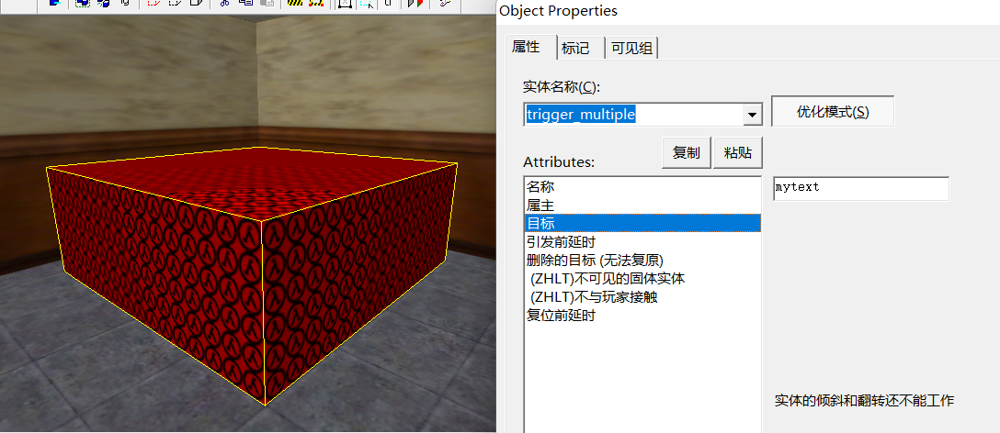

#### 显示文本
- 显示文本常用[game_text](wiki/entity/game_text)，它能在玩家HUD上显示文字，支持中文和多行
- 创建一个点实体，放在哪里都可以（一般就放在引发它的实体旁边），选择[game_text](wiki/entity/game_text)
	- “名称”填“mytext”，要和[trigger_multiple](wiki/entity/trigger_multiple)那边的“目标”一样
	- “信息文本”就是要显示的内容，这里填“你进入了触发区域！\\n5秒后能再次触发”
		- 这里的\\n是用来换行的
	- “垂直位置”填“0.3”，这样文字显示在中间偏上的位置
	- “颜色”填“255 0 0”，也就是红色
	- “淡入时间/打字时间”填“0.5”，文字出现时耗费0.5秒慢慢出现
	- “淡出时间”也填“0.5”，文字消失时耗费0.5秒慢慢消失
	- “保持时间”填“3”，除去淡入淡出，文字显示3秒
	- 
	- 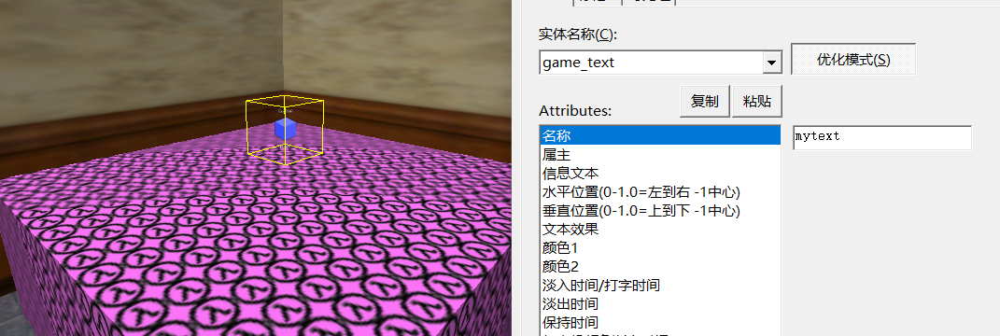
- 进入游戏，走进这个区域，会有这样的效果


## 总结
- 除了上述的各种功能外，CS还提供了各种各样的实体，来制作各种有趣的地图
	- **对战图**：你可以用炸弹、人质、VIP、土匪逃脱等相关的实体来做常规的对战图，或者这些都不用，而是放一些枪带地上做纯粹的对枪图！
	- **闯关、解谜图**：用实体制作各种机关，玩家要穿过危险的陷阱，探索地图来找到前进的方法，在CS里来一场冒险！
	- **KZ图**：想练练身法？用实体来装饰攀岩地图，或是制作连跳地图！
	- **僵尸图**：用实体移除T的枪械，给他们一把匕首、超多的HP以及更高的灵敏度，僵尸诞生了！
	- 还有很多很多....死跑图、越狱图、HNS图、昼夜求生图等等...发挥你的创意吧！
- 所有实体的介绍和使用说明可以在这里查看：[实体列表](wiki/entity/)

- 地图制作得差不多了，想要发给别人玩？下一节会详细讲解地图发布需要怎么打包