# 模型制作
- CS地图固拼的限制很大，而mdl模型能制作出更精细、效果更好的物体，阅读本教程可以让你快速制作一个能在地图里使用的mdl文件
- 如果对模型制作的原理感兴趣，可移步[CS模型吧导航贴](https://tieba.baidu.com/p/7278770386)，其中整理的《CS1.6模型修改与制作教程》非常详尽，可以系统地学习模型制作

## 本节中你会了解
- **静止模型mdl**的制作方法
- **不包含模型动画**的制作，也不包含骨骼动画相关内容
- 本教程主要描述过程，目的是能让你跟着做就能完成，尽量简短且不讲原理

## 所需软件
- **Blender**：用于格式转换、制作模型、简化模型等。任意3D建模软件均可，这里以免费开源的Blender为例，[【官网】](https://www.blender.org/download/)
- **MilkShape 3D**：简称MS3D，强大且经典的软件，这里用来导出mdl所需的smd文件，[【官网】](http://milkshape3d.com/)（付费软件，自行寻找资源(͡° ͜ʖ ͡°)，比如CS模型吧置顶贴）
- **HLMV**：模型查看软件，能直接查看mdl，顺便带了编译mdl的界面（地图工具包里有，CS模型吧置顶贴也能找到）
- **studiomdl.exe** ：编译mdl的工具。许多HLMV自带打包了一份studiomdl.exe，如果没有的话这里可以[下载](resources/studiomdl.exe ':ignore')，只有一个studiomdl.exe文件而已
- **Photoshop**：用来处理贴图。任意专业图像处理软件均可

## 步骤
一个常规的3D模型要变成mdl，需要经历几个步骤，从**源文件→obj→smd→mdl**，操作过程会比较繁琐，下面将以一个爆竹模型为例，一步步讲述该怎么做。

### 1 原始模型
- **找模型/制作模型**：你可以自己制作3D模型，或者在网上下载你喜欢的3D模型（比如[爱给网](https://www.aigei.com/)），下载任意3D格式均可
> 现代的3D模型制作常常遵循PBR流程，下载的模型中除了有漫反射（基础色）贴图，可能还包含法线贴图、金属粗糙度贴图、AO贴图等，但注意mdl几乎只支持单纯的漫反射贴图（例外可参考：[双贴图&金属贴图的作用(贴图制作)](https://www.bilibili.com/video/BV1jf4y1x7MV/?p=5&share_medium=android&share_plat=android&share_source=COPY&share_tag=s_i&timestamp=1616817495&unique_k=yMjF2p&vd_source=6ba4412e45e269558fa875a9ea3bda1d)），因此下载下来的模型只需要保留漫反射贴图（名称包括baseColor/diffuse的，看起来颜色最正常的贴图）；如果是自己制作模型，也只需要制作漫反射贴图）
> 目前比较常见的3D模型格式为obj、fbx、gltf/glb，大多数3D软件都支持打开

    - 这里以我在网上找的爆竹模型为例，下载下来是glb格式，使用blender打开
        - 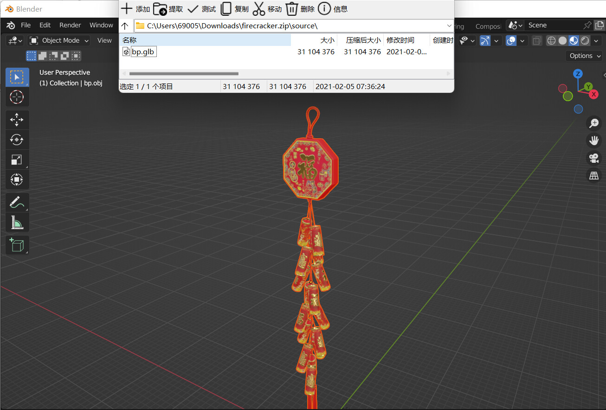

- **注意！**mdl文件的**单个smd最多支持2000个顶点**，也就是说，尽量**简化模型到少于2000个顶点**！
    - 大多数三维软件都有减面的功能，可以直接使用
    - 如果实在超过了，可以尝试把模型拆分成多个部分，分别转smd，后面编译也填多个smd，这个方法我没有尝试过，我这里就不说明了

### 2 贴图处理  
- **限制大小**：用PS打开漫反射贴图，检查大小（菜单栏→图像大小），如果宽/高超过了512像素，需要缩放到**512或以下**
    - 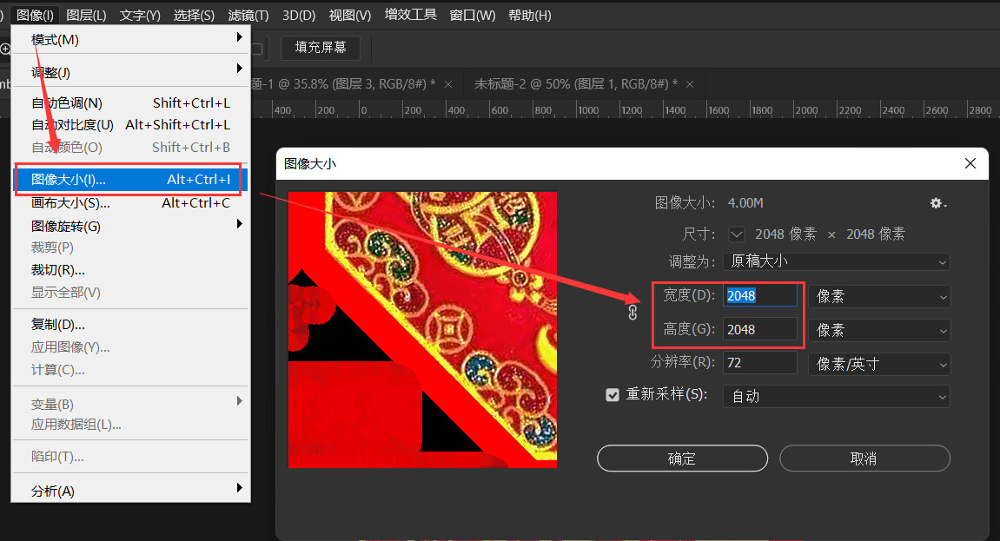

- **转索引模式**：菜单栏→模式→索引颜色→确定（如果“索引颜色”是灰色不能选，先把下面调成8位）
- **保存**：文件→另存为→BMP→一路确定即可
> mdl只支持小于等于8位索引的bmp图片做贴图，大小最多是512×512

    - 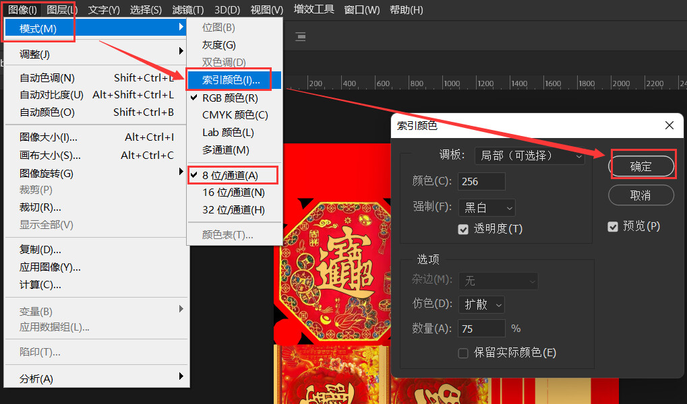

### 3 原始模型→obj
- **导出obj**：用你的3D软件制作/打开源文件后，导出为obj；以blender为例。默认选项无需修改（确认一下UV Coordinates有选中）
> 你可以导出其他格式，只要Milkshape 3D支持即可；obj是非常简单的模型格式，他只能表示简单的面以及贴图，不支持骨骼、动画等，但这对制作静止的mdl足够了

    - 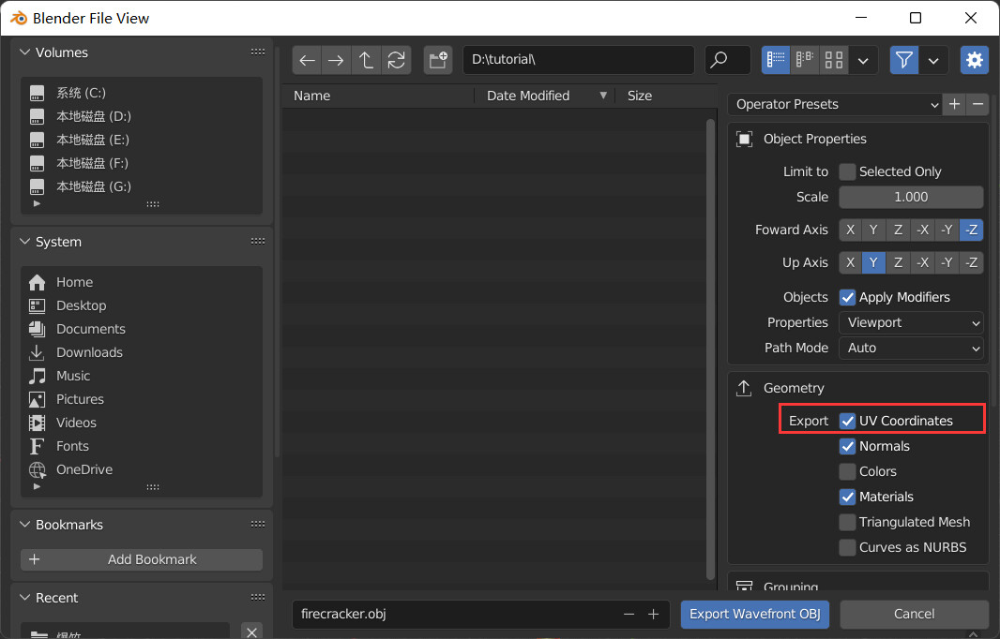

### 4 obj→smd
- **导入obj**：打开Milkshape 3D，菜单栏→File→Import→Wavefront OBJ...，选择刚刚导出的obj文件
    - 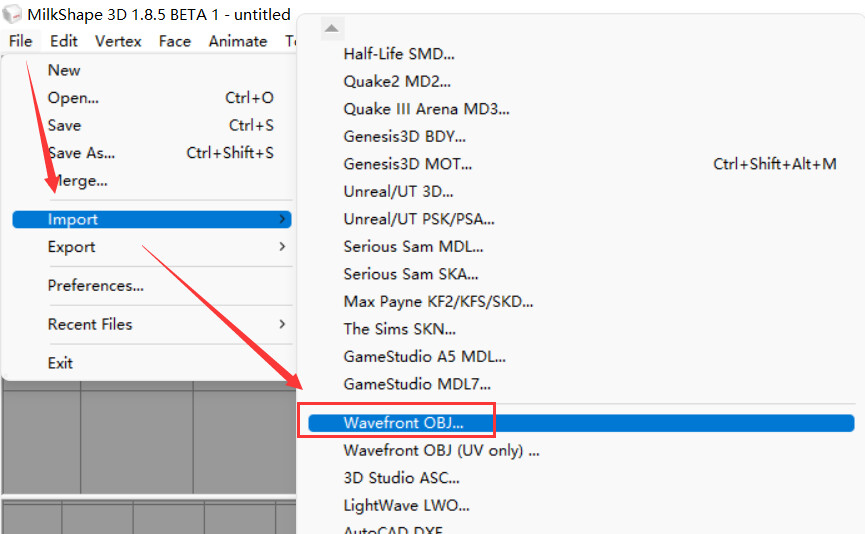
- **调整显示模式**：如果右下角看到的是白模，先试试右键→选择“Textured”；
    - 如果依旧是白模，说明没有正确找到贴图，不过没关系，稍后无论有没有我们都需要修改贴图为第二步的新贴图
        - 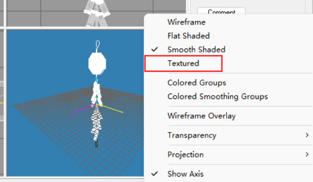
        - 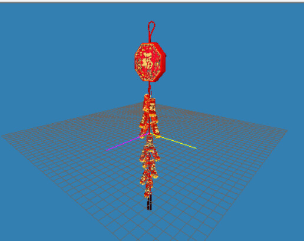
- **更新贴图**：点击右上角Material，点击图中所示位置修改漫反射贴图，改为第二步制作的新贴图
    - 我这里只有一个main材质，如果你有多个，则每个都要修改
        - 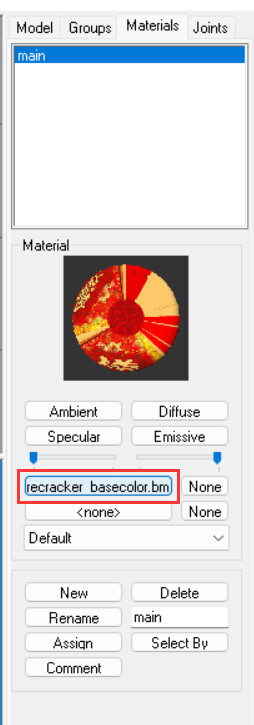
- **检查**：在右下角查看贴图是否正确（左键拖拽旋转，中键拖拽平移，滚轮缩放）
    - 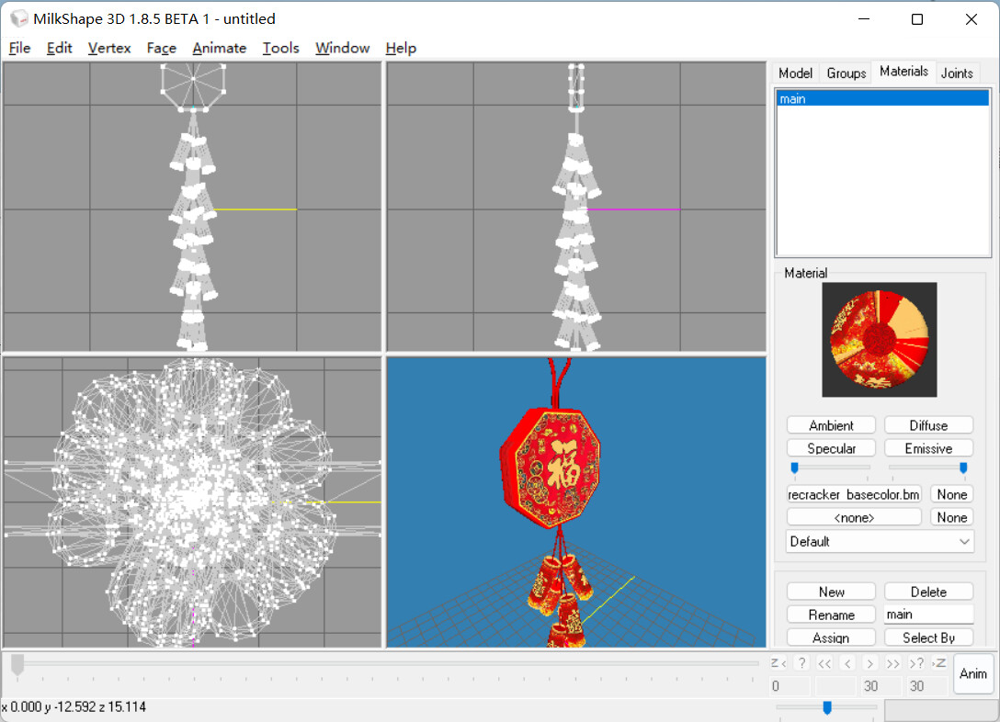
- **导出smd**：确认无误后，菜单栏→File→Export→Half-Life SMD...，导出smd，弹出菜单选默认的Reference即可；此时生成了smd，贴图也会自动复制到同一文件夹
    - 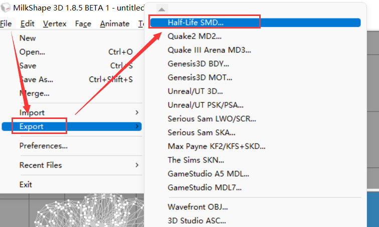
    - 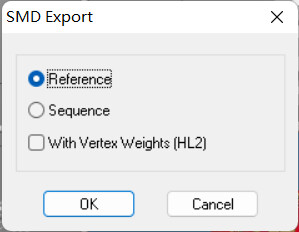

## 5 smd转mdl
- 接下来是最后一步，将smd编译为mdl
- **准备qc**：打开你导出smd的文件夹，要把smd编译成mdl，你还需要准备一份qc文件，新建一个文本文件，把后缀名改为qc（记得开启显示文件扩展名），然后用记事本打开，复制以下内容

```js
$modelname "*你模型的名字*.mdl"
$cd ".\"
$scale 1.0

$body "main" "*你smd的名字，不带.smd*"
$sequence "idle" "idle" fps 30
```

> qc文件配置了编译过程，如指定mdl由哪些部分组成，以及模型的缩放大小等等；如果模型大小不满意，可以直接修改scale的值

- 注意把星号里的内容改成你自己的，第一个就是生成的mdl的名称，第二个是你导出的smd的名称

- **添加静止动画**：除了qc你还需要一个额外的smd，静止mdl也要求必须指定一个动画，我们使用一个现成的静止动画即可；同样新建一个文本文件，改名叫做**idle.smd**，打开并输入以下内容，无需额外修改
```js
version 1
nodes
    0 "joint1" -1
end
skeleton
time 0
    0   0.000000 0.000000 0.000000 0.000000 0.000000 0.000000
end
```
- 现在目录下有这些文件了
    - 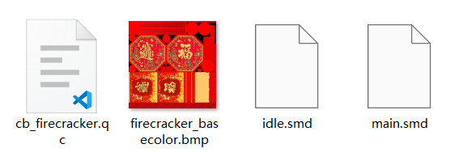
- **配置编译器**：打开HLMV，菜单栏→Tools→Options→Compiler→Path to 'studiomdl.exe'，填studiomdl.exe的路径，他是mdl的编译器，HLMV可能自带一份，如果没有的话这里可以[下载](resources/studiomdl.exe ':ignore')。
    - 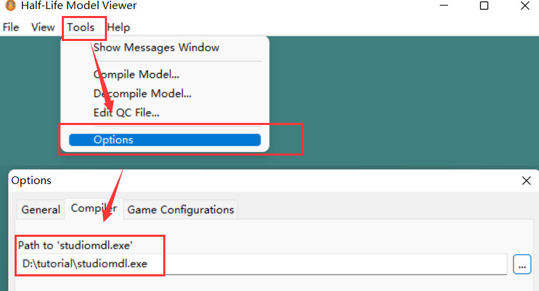
- **编译qc**：菜单栏→Compile Model...，选择qc文件，确认，等待编译完成；编译成功后，mdl会生成在qc同级目录，如果失败了可以查看输出日志的失败原因；使用HLMV打开mdl查看结果，大功告成！
    - 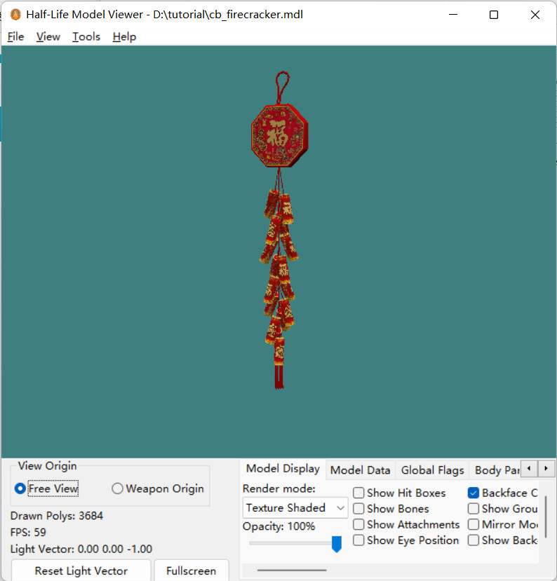

> 当你跑通过上述流程后，之后还要做模型就方便了。先按照正常流程制作、修改模型，更新贴图，导出smd，然后复制之前的qc和idle.smd，稍微修改qc，编译即可。


## 参考资料
- [CS模型吧：【入坑指南】资源 | 教程 | 工具 | 吧规 (2021版)](https://tieba.baidu.com/p/7278770386)
- [CS1.6模型修改与制作教程（2021版）](https://tieba.baidu.com/p/7277927482)
