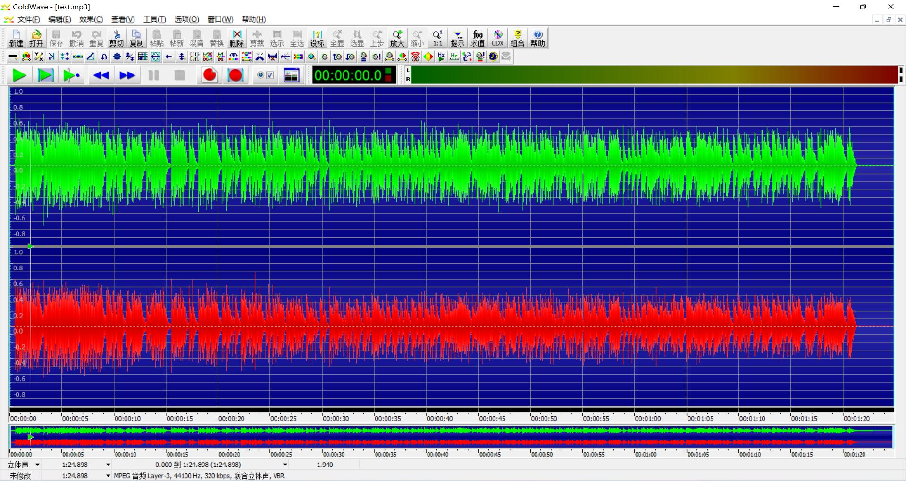
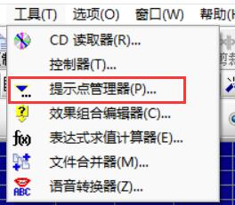
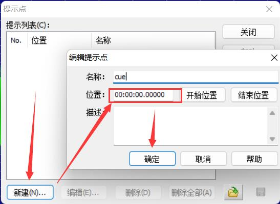
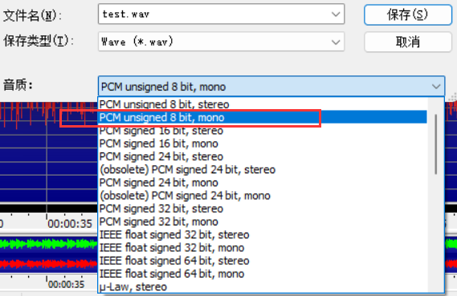

# 音效制作
## 本节中你会了解
- 如何制作**音效**（wav）（包括**循环音效**的制作）
- 本节主要描述过程，目的是能让你**跟着做就能完成**，尽量简短且不讲原理

## 所需软件  
- **Goldwave**：音频编辑，其他软件如Audition可以看参考资料里的教程

## 步骤  
- 在网上（如[爱给网](http://www.aigei.com/)））寻找你需要的音效，下载下来
- 下载的音效使用Goldwave打开
    - 
- **（可选）** 如果想要音效**循环播放**（比如环境声、音乐），需要给音频**添加CUE标记**，找到菜单栏→工具→提示点管理器，点击新建→确认位置在00:00（点下开始位置按钮可以快速设置）→名称随意输→确定
    - 
    - 
    - 这样音效播放完后不会停止，而会回到开头重新播放，循环往复

- 菜单栏→文件→另存为，选择Wave (**.wav**)类型，“音质”选“**PCM unsigned 8 bit, mono**”，放入CS目录中的sound目录里即可使用了

?> CS对音频文件有比较严格的要求，不是任意wav文件都能播放；已知的要求有，wav必须是单声道（mono），频率不能太高（有说法是不能高于22050Hz，但实测PCM unsigned 8 bit, mono下44100Hz是可用的），支持的编码格式似乎只有PCM（8bit和16bit都可）
    - 

- 如果格式有误，CS不会直接崩溃，但音效也不会播放，控制台会有提示
    - 

## 参考资料
- [【教程】【水】制作CS中可用的声音文件](https://tieba.baidu.com/p/1190378974)：这篇使用Audition软件制作，也提到了循环音效的制作方法 
- [How to add custom music to your CS-1.6 map - 2020](https://gamebanana.com/tuts/13470)
