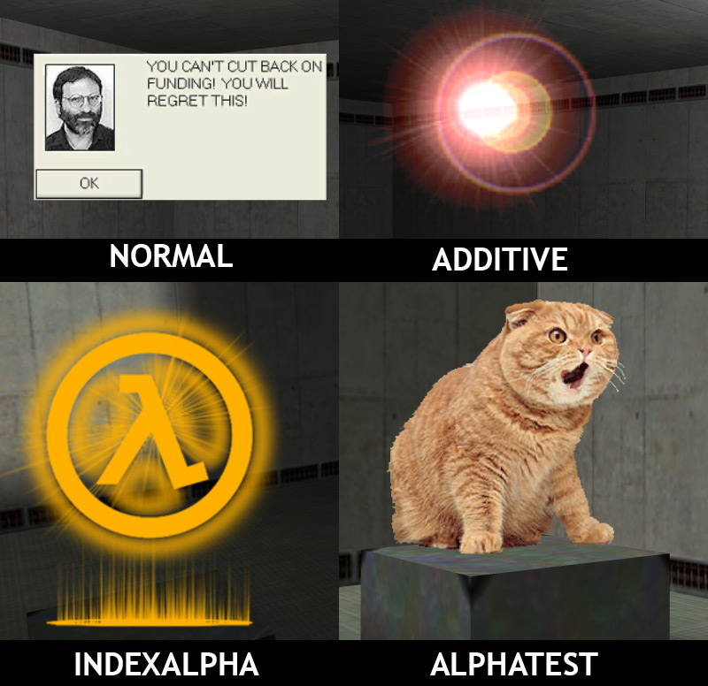
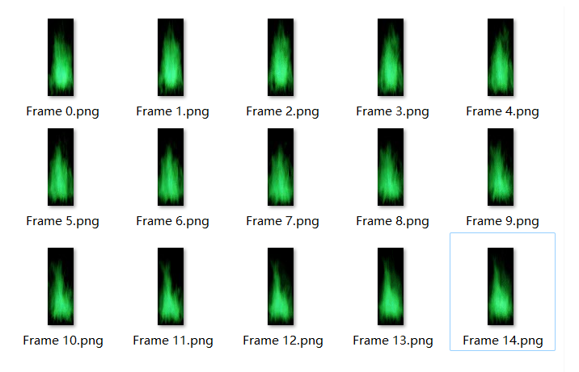
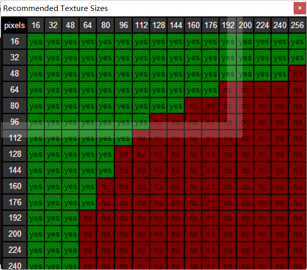
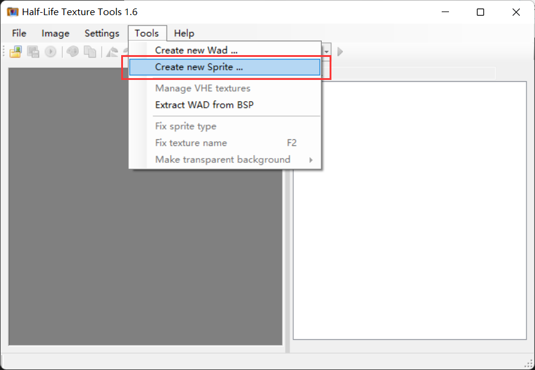
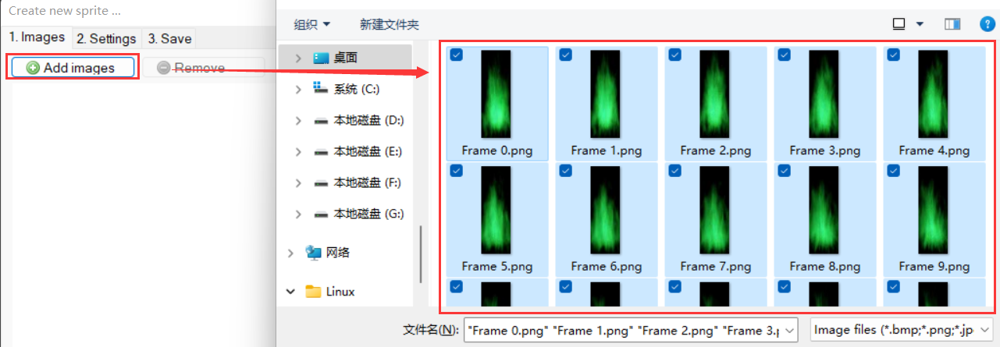
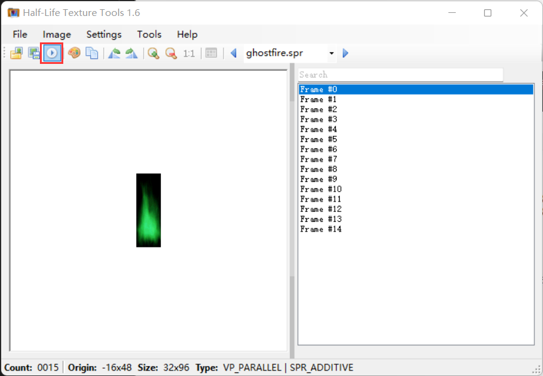

# 图标制作
CS中像烟雾、光晕、火焰等等东西很难用固拼表示，而用模型表示又大费周章了，像这种效果一般会用图标spr实现。此外像是烟雾弹的烟雾、狙击枪瞄准时的准星都是用spr实现的。

## 本节中你会了解
- 如何制作**图标**（spr）（包括**动画**的制作）
- spr的透明模式

## 所需软件  
- **HL Texture Tools**：spr查看和制作工具，比较新的软件（2018年诞生的），使用比较方便，你可以在[Half-Life Texture Tools | Valve Developer Union](https://valvedev.info/tools/half-life-texture-tools/)这里下载， 或者在作者的github仓库[yuraj11/HL-Texture-Tools](https://github.com/yuraj11/HL-Texture-Tools)上找到最新版，[【hammer工具包】](resources/CS地图制作工具包%202023.03.21.zip ':ignore')中也带有。
    - 如果HL Texture Tools出现了问题，可以使用比较老的一款软件：**Sprite Explorer**，步骤几乎是一样的。

## SPR透明模式
在开始制作spr之前，需要了解下spr的四种透明模式：
- **普通模式（Normal）**：没有透明色
- **附加模式（Additive）**：spr的颜色会直接“加”到原本颜色上面，像是发光的效果。适合火焰、激光等现象，一般用黑色做背景，因为黑色“加”到原本颜色上没有效果，看着就是透明的。
- **索引渐变模式（IndexAlpha）**：依照颜色在调色板的位置决定透明度，0（第一个颜色）代表完全透明，255（最后一个颜色）代表完全不透明。
- **透明色模式（AlphaTest）**：和```{```纹理一样，最后一个颜色代表透明色，只有这个颜色透明，其他颜色都不透明。关于```{```纹理，可以看[纹理制作：透明纹理}](tutorial/make_texture?id=透明纹理的制作 ':target=透明纹理的制作')部分

四种模式的效果和区别可以看这张图<sup>[\[source\]](https://the303.org/tutorials/gold_sprite.htm)</sup>）：


## 步骤
- 以这一串绿火为例
    - 
    - spr的动画是固定间隔的，默认是每隔0.1秒（10FPS）播放下一帧，有的实体能修改这个间隔
    - 图片宽和高必须是16的倍数，大小不能太大，具体可参考这张图
        - 
    - 软件支持多种图片格式，不过如果出问题了建议都转成png或者bmp
- 首先打开**HL Texture Tools**，点击菜单栏→Tool→Create new Sprite...
    - 
- 点击“Add Image”，然后添加图片
    - 
- 点击上面的“2. Settings”到下一步，选择渲染模式，因为是火焰所以这里我选择附加模式
    - 右侧的是spr的对齐方式，一般默认选项即可，想详细了解可以看这篇文章：[GoldSrc Sprite Tutorial](https://the303.org/tutorials/gold_sprite.htm)
    - 
- 点击上面的“3. Save”到下一步，点击最下面的“Save sprite”，选择想要的保存路径和spr名称。
    - 
- 保存后会提示是否立刻打开，选择“是”就能看到制作好的spr了，点击右上角的播放按钮观看动画
    - 


- 在游戏里的效果是这样的！


## 参考资料
- [\[教程\]SPR制作精髓文](https://bbs.tianzept.com/thread-7153-1-1.html)
- [GoldSrc Sprite Tutorial](https://the303.org/tutorials/gold_sprite.htm)