# 纹理制作

## 本节中你会了解
- 使用PS制作符合要求的纹理
- 使用Wally制作wad
- 无缝纹理、```{```透明纹理的原理和制作方法

## 所需软件  
- **PhotoShop**：编辑图片，修改尺寸和颜色模式。其他图像编辑软件均可。
- **Wally**：wad制作软件。[【hammer工具包】](resources/CS地图制作工具包%202023.03.21.zip ':ignore')中带有。

## 制作纹理
CS中的纹理有格式要求，所以需要在图像软件里调好。
> Wally其实也有简单的图像编辑功能，不过功能受限，建议还是用其他软件处理。

具体的要求有
- 长和宽都必须是**16的倍数**（如16、32、48、64、……、496、512）
- 长和宽**最大是512**，不能超过
- 必须是“**索引颜色**”模式（PS里转、Wally里转都可以）

接下来会介绍如何制作自己的纹理和wad。

- **准备纹理素材**：从网上收集或自己制作一张纹理素材，这里以logo为例，导入PS：
    - 尺寸是1024×1024
    - 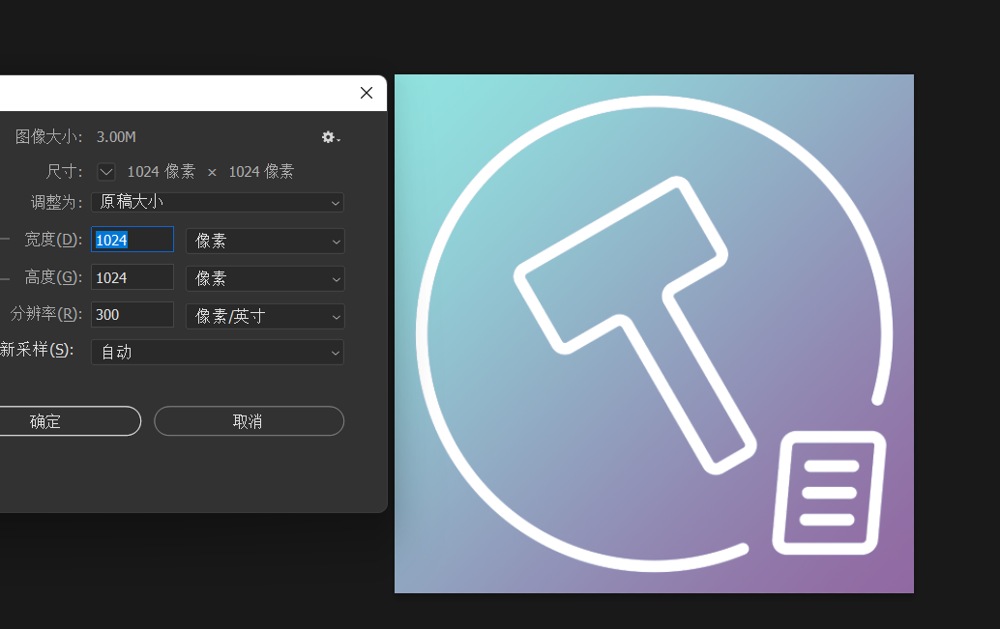
- **缩放尺寸**：如果尺寸不是16的倍数，或者太大，都需要修改尺寸。比如这里1024×1024太大了，按比例修改为512×512。在PS中，找到菜单栏→图像→图像大小，在弹出的窗口里修改尺寸，然后点击确定。
    - 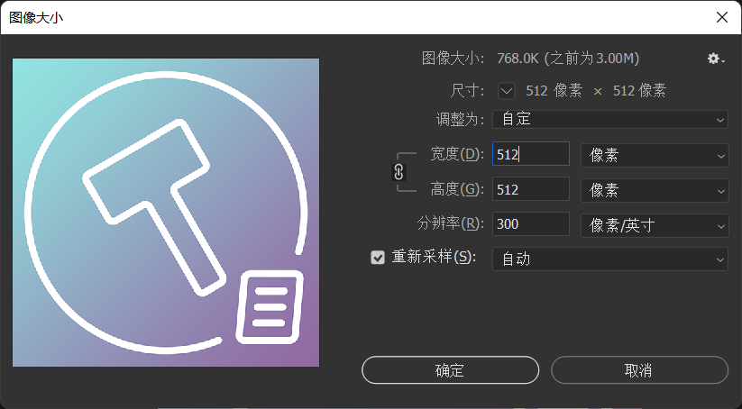
- **转索引颜色**：点击菜单栏→模式→索引颜色，会弹出设置窗口，保持默认值即可，点击确定。
    - 转索引颜色后图像质量可能下降，这是正常现象，因为索引颜色模式下，图片最多只有256种颜色。
    - 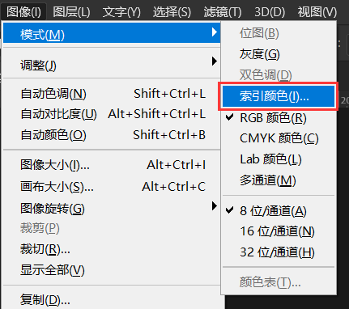 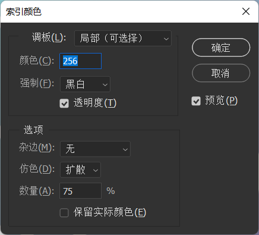
- **保存bmp**：菜单栏→存储为，格式选择bmp，选项卡默认8位。
    - 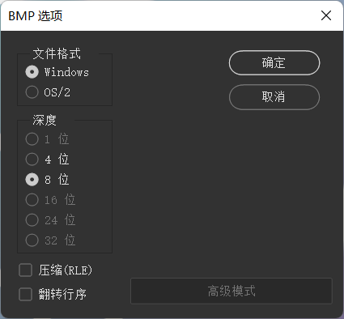
- **新建/打开wad**：打开Wally，点击菜单栏→新建，选择```Half-Life Package [wad3] (.wad)```
    - 一个wad里可以放很多张纹理，你也可以打开一个wad往里面添加纹理
    - 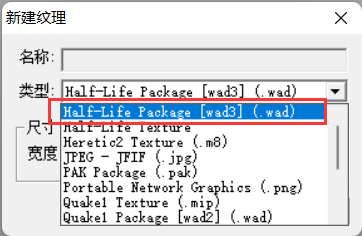
    - 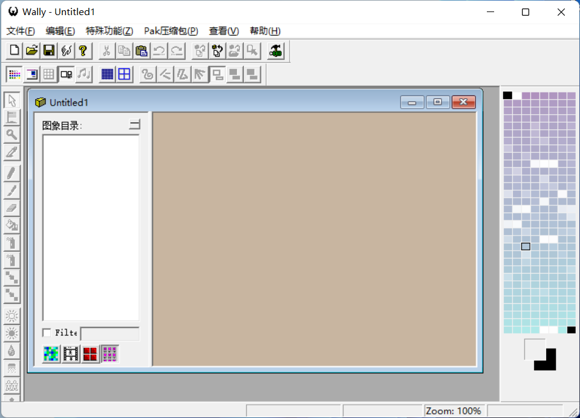
- **导入纹理**：直接把bmp文件拖入Wally的wad区域里（图中红框区域），会自动导入纹理。注意纹理名要改成英文。
    - 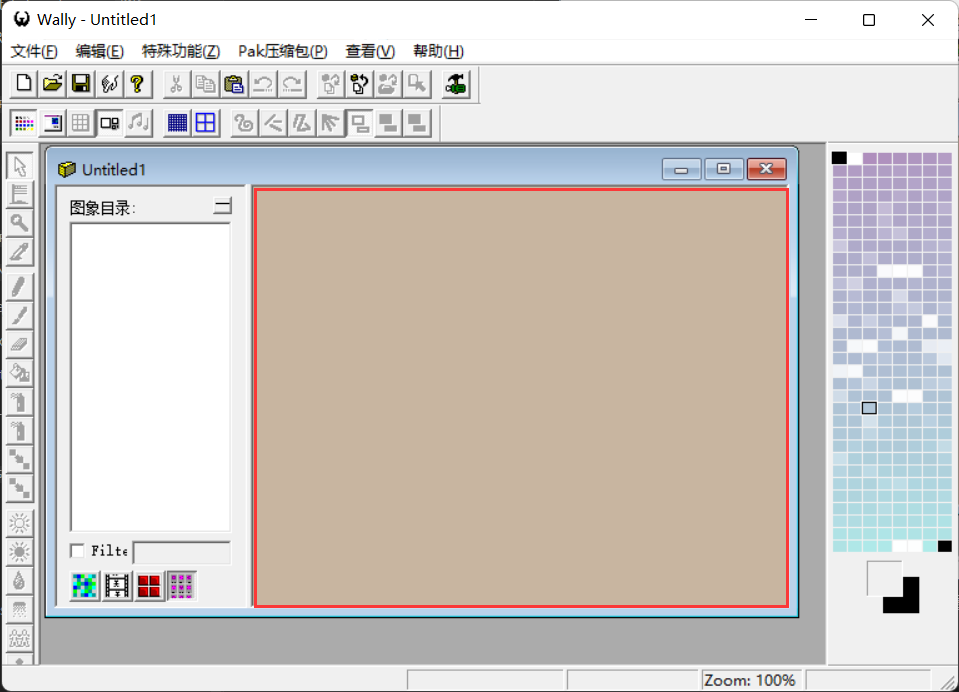
    - 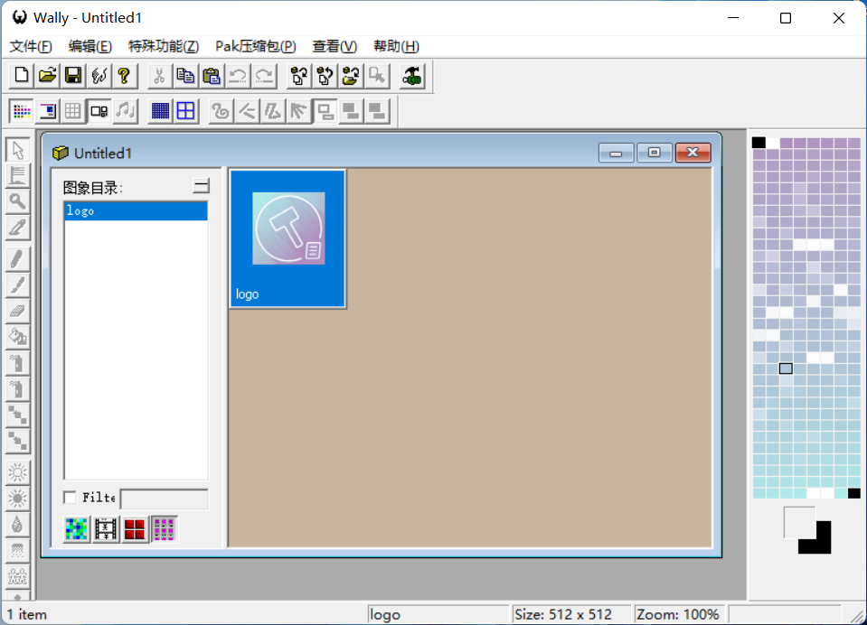
- **保存wad**：菜单栏→保存，选择保存的位置（一般就cstrike_schinese里）和名称（英文），然后就和其他wad一样，可以导入hammer使用了！
    - 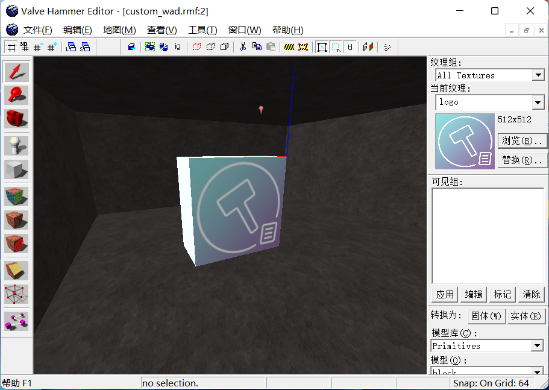

## 无缝纹理的制作
无缝纹理指的是上下或左右边界能完美拼合，看不出接缝的纹理。CS中大量使用了这种纹理，可以靠小小的一张贴图贴满整个地面和墙面，从而节省资源。
> 下图就是一张无缝纹理，以及其平铺开的效果图
> 
> 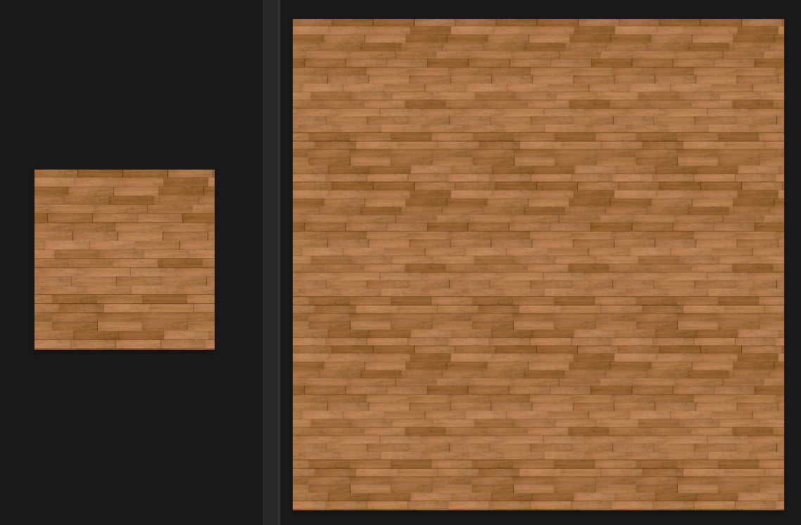

接下来会介绍一种无缝纹理的制作方法，它适合偏自然界的纹理。

- **打开纹理素材**：在PS中打开纹理，这里以一张大理石的纹理图片为例
    - 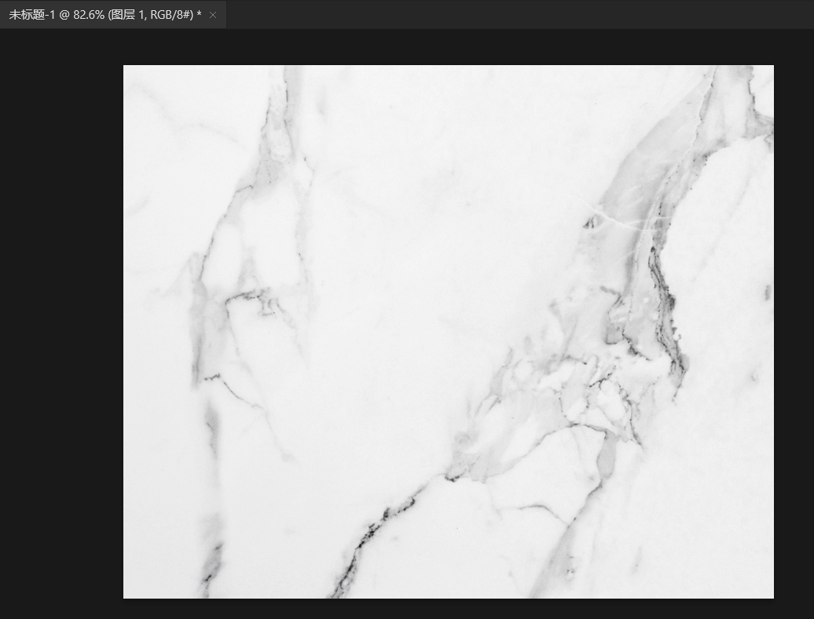
- **裁剪**：裁剪到大概是方形即可，去除多余部分
    - 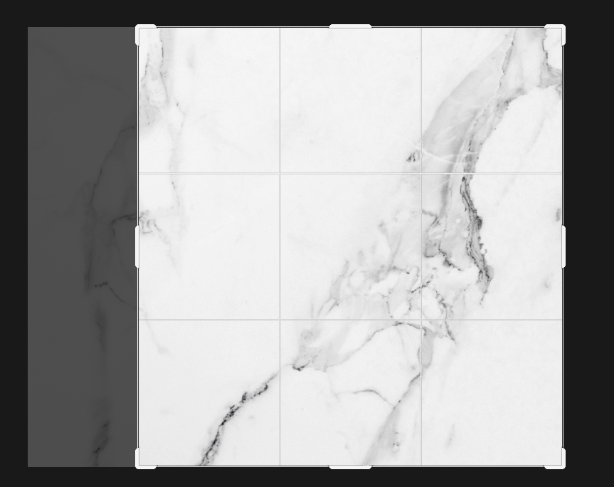
- **制造重复边界**：无缝纹理的原理是上和下能衔接，左和右能衔接，我们可以利用渐变来实现这种效果
    - **选取边界**：选择图像右侧部分，高度和图像一样，宽度视情况而定（太窄过渡差、太宽会糊）
    - **提取边界**：按下```Ctrl+Shift+J```，这会从图像里提取选择的部分并移到新的图层
    - **重叠**：把这部分移到最左侧，重叠在图像最左侧部分
    - **渐变**：右下角点击添加蒙版按钮，然后用渐变工具制作一个从左到右的渐变，形成左侧不透明，中间半透明，右侧完全透明的过渡。由此一来，拼接图像的解封就不存在了。
    - **合并图层**：合并渐变层和原始图层，方便接下来重复
    - **重复**：左右这样做了一次后，上下也这么做一次（宽度最好一样，这样出来的结果也大概是个方形）
    - **裁剪**：去除空白部分，你可以用”裁切“功能快速删除空白区域


- **调整大小和格式**：接下来和普通纹理的流程一样，调整大小到16的倍数，改为索引模式，导出bmp即可。
- 最终效果对比，左为原始纹理的平铺效果，右为无缝纹理的平铺效果
    - 


## 透明纹理的制作
透明纹理是名称以```{```开头的纹理，它可以实现纹理的部分透明，来实现梯子、铁丝网等等效果。

> 使用{LADDER1制作梯子的效果
> 
> 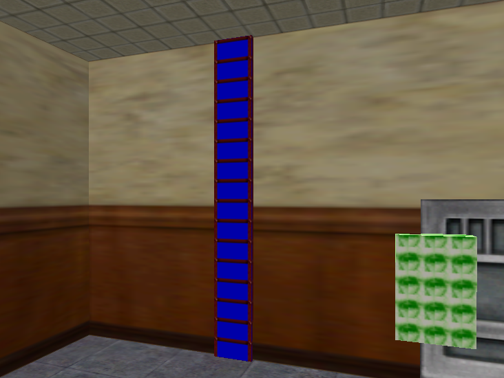 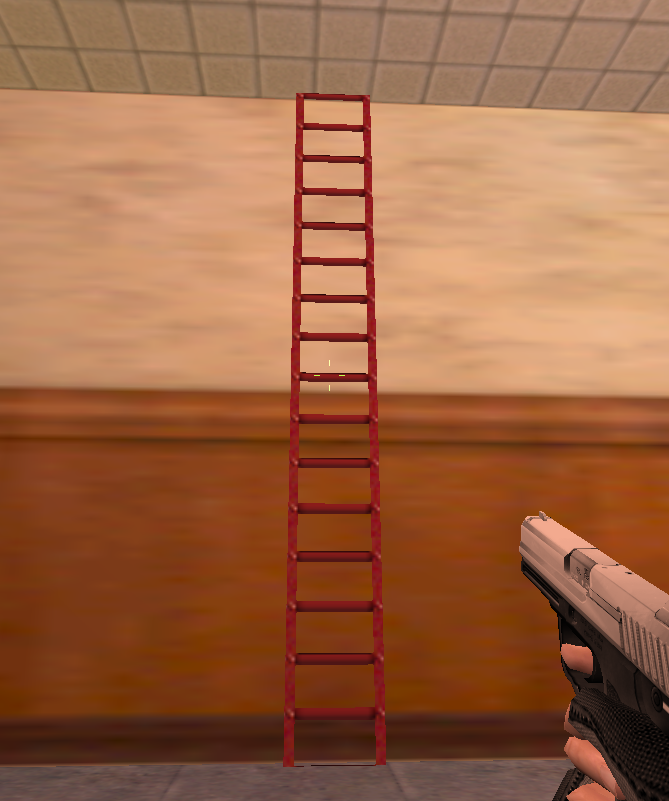

想要自己实现透明纹理，需要满足以下两点：
- 纹理名称以```{```开头，如```{LADDER1```、```{FENCE```
- 调色板最后一个颜色（第255个颜色）代表透明色，一般用蓝色表示，使用这个颜色的地方会透明

实现透明纹理可以在Wally里操作，下面以这个logo为例：
- **打开纹理**：纹理导入wad后，双击打开编辑
    - 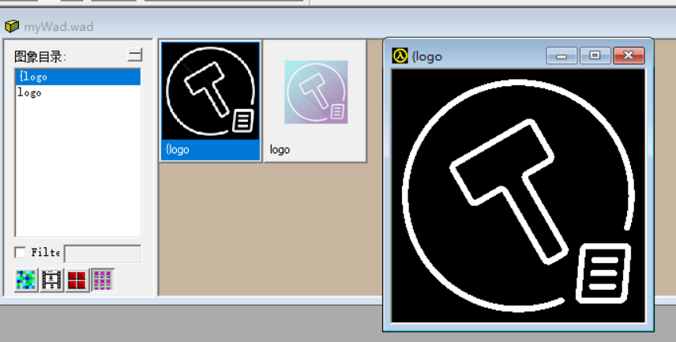
- **修改调色板**：菜单栏→颜色→编辑调色板来打开调色板，点击最后一个颜色（最右下角），颜色修改为0 0 255（理论上其他颜色也可以，不过蓝色是约定俗成）
    - 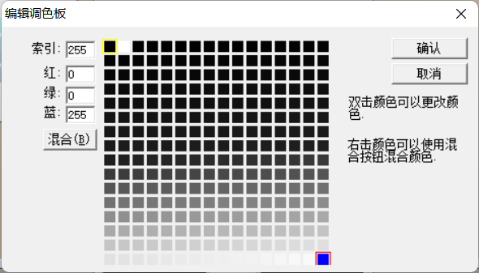
- **用透明色填充**：在右侧点击最后一个颜色，然后在需要透明的地方画上这个颜色（可以用填充功能快速上色）
    - 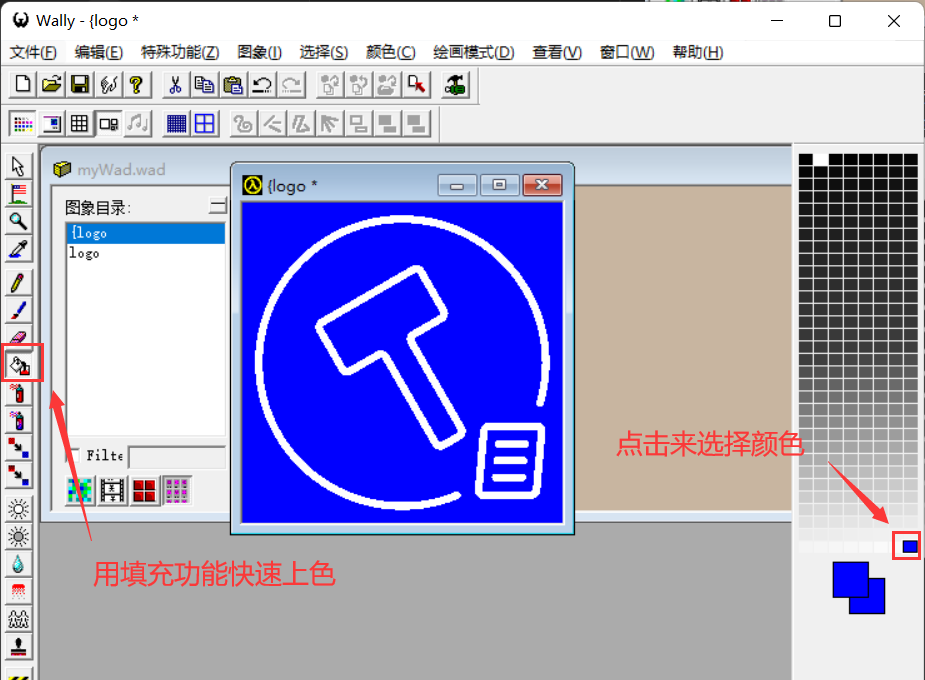
- 由此透明纹理就制作完成了！在游戏里是这样的：
    - 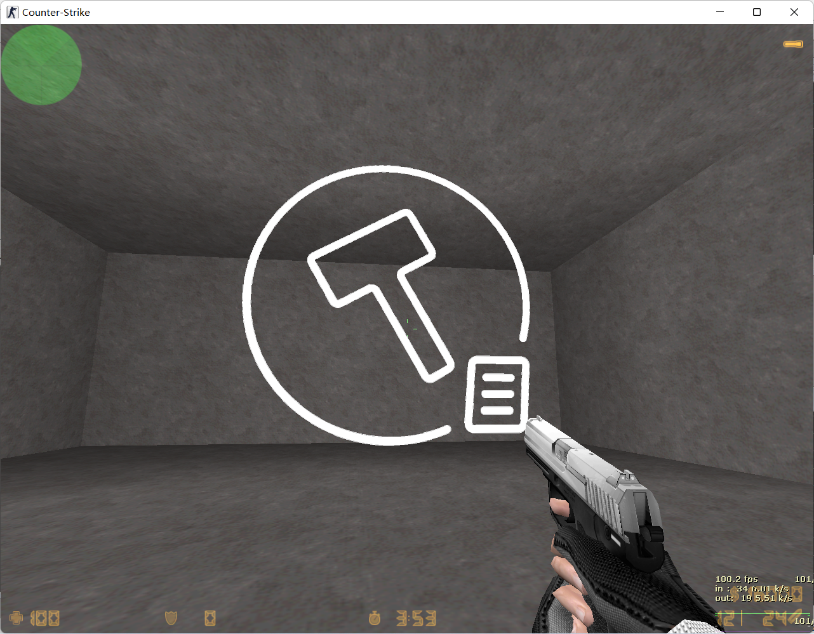