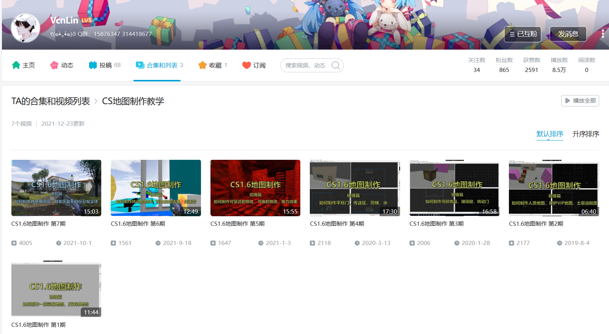

# 前言
- 接下来的教程里，你可以学会制作一张自己的CS1.6地图~😎
- 你需要准备的东西有：
  - **一台装了CS的电脑**
  - **满满的热情！**
- 你基本不需要具备其他基础知识，制作地图其实很简单！
- 除了这篇文章的教程，网络上还有许多视频教程，详见下方的其他资料。

?> 如果你做图过程中遇到任何问题，欢迎加入QQ群 [彩笔的逆袭 群号：15876347](https://jq.qq.com/?_wv=1027&k=e6eqbt1u) 讨论交流！

?> 点击右下角的**“下一节”**开始学习吧！

# 其他资料
- 图文教程
  - **X-man天书** 【[在线版](https://lotc.cc/xman/%E5%8F%8D%E6%81%90%E7%B2%BE%E8%8B%B1%E5%9C%B0%E5%9B%BE%E5%88%B6%E4%BD%9C%E5%AE%9D%E5%85%B8.htm)、[下载离线版（.chm）](resources/X-man天书.chm ':ignore')】
	- X-man是在很早以前活跃的地图制作大佬，是他制作了这本《**反恐精英地图制作天书**》，我们一般简称天书。天书里包含了很多内容，包括软件下载和配置、制作第一张地图、各种实体的介绍、地图制作的相关知识等等，是初学者入门的首选材料，也是查询实体功能的首选。
	- 
- 视频教程
  - **X.X Iao: cs1.6地图制作教程** [链接](https://space.bilibili.com/2813514/channel/seriesdetail?sid=300272&ctype=0)
    - X.X Iao(690051933/AllocBlock)在2015年制作的视频教程，包含了从软件设置、基本操作、盒子地图制作，到各种复杂的实体引发系统例子等内容。
    - 
  - **VCN: CS地图制作教学** [链接](https://space.bilibili.com/12777511/channel/seriesdetail)
    - VCN在2019年开始更新的教程，相对更加进阶，涵盖了各种模式地图的制作（炸弹地图、人质地图、VIP逃脱地图、土匪逃脱地图等）、场景的搭建布置、各种实体的应用等等。
    - 