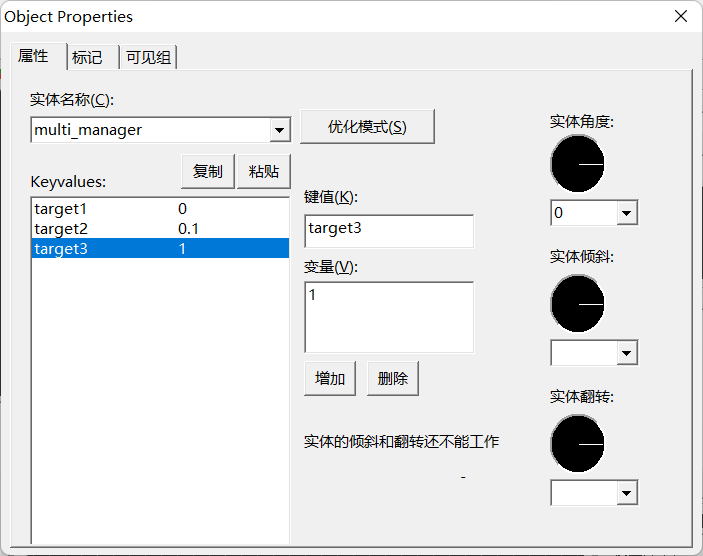

# multi_manager
[#点实体](wiki/point_entity)

用于多目标定时的点实体。你可以给它设置多个目标和引发前延时。添加目标的方法和一般的实体不同，你要在界面上关闭优化模式，点击添加，然后键值（名称）填目标名称，变量（值）就是引发前延迟，就能添加一个引发目标。

下图所示的multi_manager被引发后，会立刻引发target1，0.1秒后引发target2，1秒后引发target3。

!> 本实体最多能设置16个目标

## 属性 (property)
> **名称** *targetname* = *空* | 字符串

实体的名称，用于被其他实体引发，可参考：[引发机制](wiki/trigger)

## 标记 (flag)
> **多线程** *= 1*

勾选后，multi_manager能在还没结束前再次引发，而且可以引发自己了（可以用来做定时引发器，比如每隔1秒引发一次），如果不勾选则结束前的重复引发是无效的。比如multi_manager设置了10秒后引发其他实体，此时我们先引发multi_manager，在5秒后在引发了一次multi_manager，如果不勾选这个标记，第二次引发不会起作用，其他实体只会在第10秒被引发这一次；而如果勾选了，第二次引发会另开一个线程，其他实体会在第10秒被引发一次，15秒又引发一次。

> **死亡模式中禁用** *= 2048*

